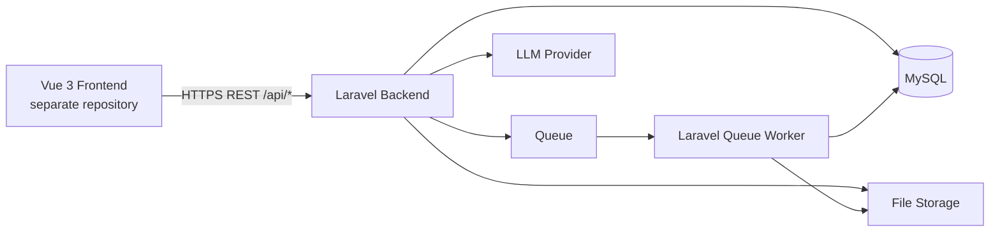
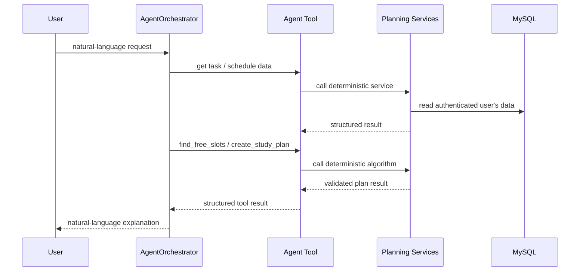
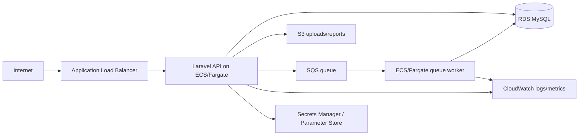

# Backend Architecture

Status: Stage 01 architecture baseline with documented Stage 02 persistence design\
Scope: Laravel backend only  
Persistence target: MySQL through Eloquent ORM  
Frontend: independent Vue application communicating through REST API

## 1. Architectural goals

The backend must support schedule management, academic tasks, free-time calculation, automatic study planning, rescheduling, reminders, progress analytics, Excel schedule import, authentication, and an AI agent that orchestrates deterministic application capabilities.

The architecture must remain understandable enough to explain during project defense, testable without an LLM, and deployable independently from the frontend.

## 2. Primary architectural decision

Use a **layered modular monolith in Laravel**.

This means:

- one backend deployable application;
- one primary MySQL database;
- code organized by Laravel conventions and business capability;
- REST API as the only contract used by the frontend;
- deterministic business logic in Services;
- Eloquent models used for persistence;
- Policies used for resource authorization;
- Form Requests used for input validation;
- API Resources used for response serialization where useful;
- queued Jobs for asynchronous work;
- the AI agent is an orchestration module that calls application tools/services and does not replace business rules.

Microservices are intentionally not used at this stage. The domain is broad, but the project does not currently justify distributed transactions, multiple deployments, independent teams, or duplicated infrastructure.

## 2.1 Current repository baseline (2026-10-05)

The repository now includes Stage 02 persistence Migration Groups 1–3 alongside its Laravel/Sanctum scaffold:

- Laravel `^13.17` on PHP `^8.3`;
- Laravel Sanctum `^4.0` is installed;
- framework users/cache/jobs migrations and Sanctum's `personal_access_tokens` migration remain present; seven additional migrations implement `users.timezone`, typed `planning_preferences`, recurring `study_availability_windows`, user-owned `education_institutions`, explicit `academic_periods`, `subjects`, and `teachers`;
- `User`, `PlanningPreference`, `StudyAvailabilityWindow`, `EducationInstitution`, `AcademicPeriod`, `Subject`, and `Teacher` models provide the current user/institution relationships, numeric/date casts, and factories; MySQL enforces the approved keys, indexes, uniqueness constraints, owner cascade deletes, optional institution `SET NULL` deletes, and CHECK constraints;
- `routes/api.php` currently defines only `/user`, mounted at `GET /api/user` and protected with `auth:sanctum`; API versioning is not implemented;
- `.env.example` selects MySQL (`student_planner`), and `phpunit.xml` selects a separate MySQL test database (`student_planner_testing`);
- `config/database.php` retains Laravel's default SQLite fallback when `DB_CONNECTION` is absent. This fallback does not override the explicit MySQL environment configuration and does not need to be changed in Stage 01;
- Groups 1–3 implement persistence only; planning-preference and academic CRUD APIs, ownership validation Services, and import/schedule/tasks/planning application capabilities remain unimplemented. Optional institution references use simple foreign keys; same-owner compatibility requires later application validation. Groups 4–9 persistence remains design-only, with Group 4 (`schedule_import_batches`, `schedule_import_rows`) next;
- MySQL-backed `PlanningPersistenceTest`, `AcademicContextPersistenceTest`, and `PlanningMigrationTest` cover schema definitions, relationships, constraints, user-data separation, and the limits of simple ownership FKs. Rollback/reapply coverage dynamically counts domain migrations, preserves the four scaffold migrations and existing users, verifies Groups 1–3 return, and accommodates later additive groups; scaffold examples remain, while authentication and planning API behavior are not yet covered.

Architecture sections below describe the intended direction. Their implementation-pending statements now apply to the remaining persistence groups and application capabilities; the completed Groups 1–3 scope is recorded here and in [database-schema.md](database-schema.md). Suggested directories/classes are created only when a concrete feature requires them.

The architectural decision and alternatives are recorded in [ADR-001](decisions/ADR-001-backend-architecture.md). Domain concepts, rule IDs, and persistence questions are recorded in [the conceptual domain model](domain-model.md), [business rules](business-rules.md), and [database review notes](database-review-notes.md).

## 3. High-level system boundary



The frontend never connects directly to MySQL, queues, storage, or the LLM provider.

## 4. Backend layers

### 4.1 HTTP/API layer

Responsibilities:

- receive HTTP requests;
- authenticate the user;
- validate request shape through Form Requests;
- authorize access through Policies/Gates;
- call an application Service;
- return API Resources / JSON responses;
- contain no planning algorithm or domain calculation.

Typical locations:

```text
app/Http/Controllers/Api/  # introduce version namespace only if/when API versioning is adopted
app/Http/Requests/
app/Http/Resources/
app/Policies/
routes/api.php
```

Controllers should remain thin. A controller should coordinate the HTTP use case, not implement free-time calculation, conflict detection, priority ordering, statistics, or AI logic.

### 4.2 Application/business layer

This is where deterministic use cases and business rules live.

Recommended service groups:

```text
app/Services/
├── Accounts/
├── Schedule/
├── Tasks/
├── Planning/
├── Reminders/
├── Progress/
├── Imports/
└── Agent/
```

Representative services, introduced only when needed by implemented use cases:

- `ScheduleService`
- `ScheduleImportService`
- `ConflictDetectionService`
- `TaskService`
- `FreeTimeService`
- `StudyPlanningService`
- `TaskReschedulingService`
- `ReminderService`
- `ProgressReportService`
- `AgentOrchestrator`

Do not create one service per trivial CRUD method and do not add repository interfaces merely to wrap Eloquent. Add abstractions only when they isolate a real external dependency or reduce meaningful duplication.

### 4.3 Persistence layer

Use Laravel Eloquent ORM and migrations.

Recommended conventions:

```text
app/Models/
database/migrations/
database/factories/
database/seeders/
```

Eloquent models represent persistence state and relationships. Complex planning rules should not be hidden in model events or accessors. Query scopes may be used for reusable query constraints, but orchestration belongs in Services.

The approved Stage 02 tables, columns, foreign keys, indexes, enum representation, and delete behavior are documented in [database-schema.md](database-schema.md) and [the companion DBML](database-schema.dbml). Domain migrations and model relationships are not yet implemented; known constraint-enforcement issues are recorded there for resolution before affected migrations.

### 4.4 Infrastructure / integrations

External concerns should be behind small application-facing boundaries when practical:

- LLM provider client;
- file storage;
- queue driver;
- email/notification transport;
- optional calendar integration later.

Laravel filesystem, queue, notification, cache, and HTTP abstractions should be preferred before introducing custom adapters.

## 5. Business modules

The modular monolith is divided conceptually into these capabilities:

1. **Identity & Profile** — registration, authentication, profile, timezone, planning preferences.
2. **Academic Context** — subjects and optional academic reference data such as teachers/institution.
3. **Schedule** — lessons, replacements/cancellations, schedule lookup, Excel import.
4. **Tasks** — assignments, subtasks, deadlines, priorities, completion state.
5. **Planning** — free-time calculation, conflicts, study sessions, automatic planning, rescheduling.
6. **Reminders** — reminder lifecycle and delivery scheduling.
7. **Progress & Reports** — deterministic statistics and progress reports.
8. **AI Agent** — natural-language orchestration over tools exposed by the modules above.

These are modules inside one Laravel application, not separate services or databases.

## 6. Request flow

Example: manually create an academic task.

```mermaid
sequenceDiagram
    participant F as Frontend
    participant C as Controller
    participant R as Form Request
    participant P as Policy
    participant S as TaskService
    participant M as Eloquent Models
    participant D as MySQL

    F->>C: POST /api/tasks (illustrative; exact endpoint deferred)
    C->>R: validate input
    C->>P: authorize action
    C->>S: create task
    S->>M: persist model(s)
    M->>D: SQL transaction
    S-->>C: result
    C-->>F: API Resource / JSON
```

## 7. Planning flow

Example: "Find two hours for my coursework this week".

The LLM must not calculate the actual time slots.



The agent chooses which operation is needed. Services decide whether a slot is valid, whether a deadline is violated, whether sessions overlap, and whether user limits are exceeded.

## 8. AI agent boundary

`AgentOrchestrator` may:

- interpret user intent;
- choose one or more tools;
- ask for missing information;
- sequence tool calls;
- explain deterministic results;
- request confirmation for destructive or high-impact actions.

`AgentOrchestrator` must not:

- directly write Eloquent models;
- invent free slots;
- calculate deadline feasibility itself;
- bypass Policies or authenticated-user scoping;
- trust a `user_id` supplied by the model;
- silently violate planning settings to satisfy the user request.

Tools are thin application adapters over Services. They receive structured arguments, obtain the authenticated user from trusted application context, call a Service, and return a structured result.

## 9. Authentication and authorization

The current repository already includes Laravel Sanctum and the default API user route is protected with `auth:sanctum`. This establishes Sanctum as the current authentication package baseline, but full registration/login/logout/password-reset and SPA authentication behavior are not implemented by Stage 01. Their exact flow belongs to the authentication implementation stage.

Authorization is resource-based:

- every user-owned schedule item, task, study session, reminder, conversation, and report is scoped to its owner;
- Policies/Gates enforce access at HTTP/tool boundaries;
- Services should not accept arbitrary user IDs from public request payloads when the authenticated user can be derived from context.

Password reset and password change belong to the account module.

## 10. Time model

Planning is time-sensitive, so time handling is an architectural concern.

Rules:

- store concrete domain instants as UTC DATETIME values;
- store the user's IANA timezone in the profile;
- store recurring local availability as TIME values;
- interpret "today", "tomorrow", day boundaries, weekly limits, and reminder time in the user's timezone;
- convert to presentation timezone only at the API/application boundary;
- never use server-local timezone as a business rule.

The approved MySQL column types are recorded in [database-schema.md](database-schema.md). Existing framework/audit timestamp types are preserved as specified; these design decisions have not yet been implemented.

## 11. Transactions and consistency

Use database transactions for use cases that must be atomic, for example:

- commit of an approved schedule import;
- generation of a study plan that creates several sessions;
- rescheduling that replaces future sessions;
- operations that update a task together with dependent planning state.

Do not use transactions around LLM network calls. The agent should call the LLM first, then execute short deterministic tool transactions.

## 12. Asynchronous work

Use Laravel Jobs/queues for work that should not block an HTTP request, such as:

- larger Excel imports after validation/preview when appropriate;
- reminder delivery;
- expensive report generation;
- external integrations;
- optional long-running AI operations if required later.

Local development may use a simple queue driver. Deployment may switch to Redis or Amazon SQS without changing business Services.

## 13. Events and side effects

Use Laravel events/listeners only where they improve decoupling of real side effects. Examples:

- `TaskCompleted` -> update/report side effects;
- `StudySessionMissed` -> trigger rescheduling workflow;
- `ScheduleChanged` -> mark affected future planning as needing review.

Do not use events to hide the main business flow. Core state changes should remain visible in the calling Service.

## 14. Excel import architecture

Import is a two-phase use case:

1. parse and validate file;
2. show preview and errors;
3. after explicit confirmation, commit accepted rows.

The parser does not write directly to final schedule records during preview. Duplicate/conflict detection uses deterministic rules. Re-import should be idempotent enough to avoid silently duplicating the same schedule data.

## 15. API design baseline

- REST/JSON endpoints under Laravel's API routing boundary;
- do not require a version prefix yet; API versioning can be introduced deliberately when the public contract is designed;
- JSON request/response contract;
- resource-oriented endpoints for normal CRUD;
- action endpoints only for real use cases such as preview import, plan generation, reschedule, and reports;
- consistent validation-error format;
- pagination for collection endpoints where lists can grow;
- filters/sorting expressed as query parameters;
- no frontend-specific database field leakage where an API Resource can provide a stable contract.

Exact endpoints are deferred until the related backend feature is implemented.

## 16. Recommended Laravel application structure

Keep framework conventions rather than building a custom framework inside Laravel.

```text
app/
├── Enums/                 # only when concrete enums are introduced
├── Events/
├── Exceptions/
├── Http/
│   ├── Controllers/Api/      # optional V1 namespace only after an API-versioning decision
│   ├── Requests/
│   └── Resources/
├── Jobs/
├── Models/
├── Notifications/
├── Policies/
└── Services/
    ├── Accounts/
    ├── Agent/
    ├── Imports/
    ├── Planning/
    ├── Progress/
    ├── Reminders/
    ├── Schedule/
    └── Tasks/
```

Do not create all empty directories up front. Create them when the first real class for that capability is implemented.

## 17. Testing architecture

Business rules must be testable without the frontend and without an LLM.

- Unit tests: pure/deterministic planning calculations where possible.
- Feature tests: HTTP endpoints, validation, authorization, database changes.
- Integration tests: MySQL-dependent flows, queue/storage adapters when necessary.
- Security tests: cross-user access must fail.
- AI tests: tool selection/arguments and orchestration; they do not replace Service tests.
- Regression tests: bugs in planning rules become permanent tests.

## 18. Deployment target: AWS, but not an application dependency

AWS is a suitable later deployment target, but Stage 01 should keep the Laravel application cloud-portable.

A reasonable future production topology is:



For a student project, start simpler and add infrastructure only when Stage 07 begins. The application should use environment variables and Laravel abstractions so local development can use MySQL/local storage/simple queues while AWS uses RDS/S3/SQS.

## 19. Explicit non-goals for Stage 01

- no microservices;
- no event sourcing;
- no CQRS framework;
- no custom repository layer around every Eloquent model;
- no vector database unless a later concrete AI requirement proves it necessary;
- no frontend architecture yet;
- no physical database schema changes yet;
- no AWS provisioning yet.

## 20. Persistence design and later stages

Stage 02:

- physical mapping, fields/types, foreign keys, delete behavior, indexes, scalar enum storage, and explicit target relationships are approved and documented in [database-schema.md](database-schema.md);
- migrations, model relationships, and factories remain unimplemented;
- resolve the documented MySQL enforcement issues before implementing affected migration groups.

Stage 03:

- exact API endpoints and Resources;
- concrete Services and controller boundaries.

Stage 04:

- LLM provider;
- tool schemas;
- orchestration prompt;
- confirmation matrix;
- AI evaluation suite.

Stage 07:

- exact AWS topology, sizing, networking, secrets, CI/CD, staging and production deployment.
