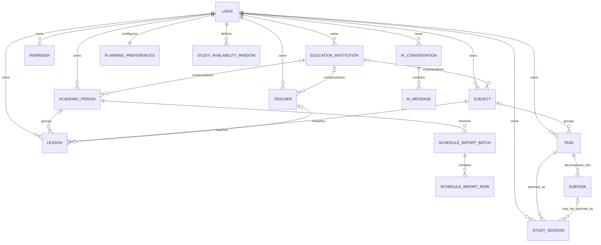

# Conceptual Domain Model

Status: conceptual model synchronized with the approved Stage 02 design\
Important: this document defines **domain concepts and ownership**. The approved physical MySQL design and Eloquent relationship intent are documented in [database-schema.md](database-schema.md) and [the companion DBML](database-schema.dbml), not duplicated here. Domain migrations and model relationships have not been implemented.

Only the default `User` model is currently implemented. References below to an earlier SQL/ER draft come from the supplied Stage 01 review; that source draft is not present in this repository and its details have not been independently verified. See [database review notes](database-review-notes.md).

## 1. Domain boundaries

### Identity & Profile

**User**  
Authenticated owner of private planning data.

**Planning Preferences**  
User-defined constraints such as maximum daily/weekly workload, breaks, and session bounds. Stage 02 uses one typed planning-preferences row per user, not an opaque planning JSON column. Nullable numeric values use system defaults once those defaults are decided.

**Study Availability Window**\
A recurring local study window for an ISO day of the week. Windows are separate from numeric preferences; overnight availability is split into two windows. The user's IANA timezone belongs to the profile. Concrete domain instants are UTC, while recurring windows use local wall-clock times.

### Academic Context

**Subject**  
User-owned academic course/subject used to group lessons and optionally tasks. It may reference the user's education institution; it is not a shared global catalog in V1.

**Teacher**  
User-owned teacher metadata attached to lessons when available. It may reference the user's education institution; it is not a shared global catalog in V1.

**Education Institution**  
A user-owned supporting academic concept. Subjects, teachers, and academic periods may optionally reference an institution owned by the same user. V1 does not use shared institution reference data.

**Academic Period / Semester**  
A persisted, user-owned semester/academic-period boundary and explicit target for schedule imports. Importing a new semester must not implicitly delete historical periods. Periods with schedule/import history are protected from destructive deletion.

### Schedule

**Lesson**  
A concrete, user-owned scheduled occurrence with a subject, start/end time, type, and optional teacher/room metadata. Its lifecycle distinguishes active, cancelled, and replaced entries; normal deletion is soft deletion.

**Lesson Replacement / Schedule Change**  
A replacement is another lesson linked to its original through the approved self-reference. The original becomes `replaced` and the replacement is `active`; both resolve to the same owner. Cancelled, replaced, and soft-deleted lessons do not block free time.

**Schedule Import Batch**  
A persisted process entity representing one Excel import attempt, its academic period, source-file identity, validation state, and commit history. Persisted import rows retain preview data and row-level errors. Imported lessons use deterministic SHA-256 identity from normalized subject identity/name and start/end instants; teacher, room, and type are excluded.

### Tasks

**Task / Assignment**  
A user-owned academic work item with a title, optional subject, deadline, priority, estimated effort, and completion lifecycle. Completion timing is retained for on-time/late statistics; normal deletion is soft deletion.

**Subtask**  
A smaller ordered step belonging to exactly one task and inheriting its ownership. Its position gives deterministic ordering; it may have its own estimate and deadline. Active (non-soft-deleted) subtasks are authoritative schedulable work; when none exist, the task estimate is used. Parent and subtask estimates are never counted for the same work. Normal deletion is soft deletion.

### Planning

**Study Session**  
A concrete reserved time block with a required task and optional subtask belonging to that same task. It retains scheduled timing, optional completion timing, and actual minutes separately. Rescheduling creates a new session linked to its predecessor; history uses lifecycle states rather than soft deletes.

**Free Time Slot**  
A calculated result, not persisted in V1. It is produced by subtracting blocking events and constraints from the user's allowed study windows.

**Planning Result / Planning Run**  
A transient result representing generated sessions, warnings, unscheduled work, and feasibility. V1 has no planning-run history table; a later concrete audit requirement would be needed to add one.

**Planning Conflict**  
A calculated result describing an overlap, insufficient capacity, deadline violation, or user-constraint violation. Returned by Services and not persisted in V1.

### Reminders

**Reminder**  
A user-owned instruction to notify the user at a specific instant. It has at most one explicit target: task, subtask, or study session; all targets may be absent for a general reminder. Relative reminders use a task deadline, subtask deadline, or session start as their anchor and retain the signed offset and resolved trigger instant. Absolute reminders have no anchor/offset.

**Reminder Delivery**  
Delivery status belongs to the reminder lifecycle in V1. Separate delivery-attempt history is deferred until a concrete audit requirement justifies it.

### Progress & Reporting

**Progress Metrics**  
Derived read data: counts, completion percentage, planned vs actual workload, late completion, subject workload. V1 does not persist general metric snapshots.

**Progress Report**  
A generated view/document for a selected period. V1 has no report-history table; retaining reports requires a later concrete requirement.

### AI Agent

**AI Conversation**  
User-owned conversational context.

**AI Message**  
A persisted message within a conversation, with a `system`, `user`, `assistant`, or `tool` role. Structured tool-call metadata may remain JSON because it describes orchestration, not deterministic planning state.

**Agent Tool Call**  
Conceptually an orchestration action. It may live inside message metadata initially; a separate audit entity is only justified if tool-level auditing becomes a requirement.

## 2. Conceptual relationships

This diagram summarizes conceptual associations, not physical columns or constraints. See [database-schema.md](database-schema.md) for the approved persistence details, including lesson replacement and session rescheduling self-references.

Every study session references a task; its subtask reference is optional and must belong to that task. Reminder target associations are mutually exclusive and are described above rather than expanded into the diagram.

## 3. Aggregate / consistency boundaries

These are reasoning boundaries, not mandatory Laravel class structures.

### User-owned planning data

Every private resource belongs to exactly one authenticated user, directly or through a parent. Cross-user references are invalid.

### Task aggregate

A task owns its subtasks. Operations that reorder subtasks or calculate task progress should preserve task-level consistency.

### Plan/session consistency

Creating or rescheduling several study sessions for one planning action should be atomic when partial persistence would create an invalid plan.

### Schedule import consistency

A preview has no effect on the active schedule. Commit of an accepted import should use a transaction or another mechanism that prevents a half-imported schedule.

## 4. Value concepts

The following concepts should be represented explicitly in code when their behavior becomes non-trivial, but not necessarily as database tables:

- time interval;
- date range;
- estimated duration in minutes;
- priority;
- task status;
- lesson status/type;
- study-session status;
- planning constraint set;
- free slot;
- planning warning/conflict;
- progress percentage.

Lifecycle states use PHP string-backed enums over bounded scalar columns when implemented; priority uses an integer-backed enum. MySQL ENUM is not the baseline strategy. Introduce value objects only when they make rules safer or clearer, not for every scalar field.

## 5. State semantics to preserve

### Task and Subtask

Both persist only `pending` or `completed`. Completion requires a completion instant; pending work has none. Task priority is LOW = 1, NORMAL = 2, HIGH = 3.

**Overdue is derived from deadline, completion state, and current time, never persisted as another V1 status or flag.**

### Study Session

Persisted states are `planned`, `completed`, `missed`, `rescheduled`, and `cancelled`. A successor records its predecessor, whose state becomes `rescheduled`. Completed sessions retain completion timing and may retain actual minutes.

### Lesson

Persisted states are `active`, `cancelled`, and `replaced`. Only active, non-soft-deleted lessons block planning.

### Reminder

Persisted states are `scheduled`, `sent`, and `cancelled`. Sent reminders retain delivery timing; relative reminders must be recalculated when the associated deadline/session changes.

### Deletion and history

Lessons, tasks, and subtasks use soft deletion. Deleting a task also soft-deletes its subtasks and cancels affected future planned sessions, while completed/missed/rescheduled history remains. Scheduled reminders targeting that task are cancelled or removed by the Reminder service. Study sessions retain history through lifecycle states.

Teacher removal may clear lesson teacher references. Subjects referenced by lessons cannot be hard-deleted; task subject references may become null. Academic periods with schedule/import history are protected. Normal domain deletion is distinct from administrative/account hard purges; the physical schema records the approved FK actions.

## 6. Derived data

V1 does not persist data solely for deterministic calculated results.

Derived examples:

- free slots;
- overdue flag;
- task progress percentage;
- daily/weekly planned workload;
- subject workload totals;
- feasibility warnings;
- most statistics and report aggregates.

Planning runs, generated report history, and reminder-delivery history are also excluded from V1. A later concrete performance, retention, or audit requirement is needed to introduce additional persistence.

## 7. Resolved design and remaining work

The former Stage 02 ownership, academic-period, target-reference, replacement, enum, and deletion/history questions are resolved by [the approved physical schema](database-schema.md). Its implementation issues section records MySQL constraint enforcement questions without reopening those domain decisions.

Stage 03 still needs to define product defaults for study hours, breaks, and session bounds; conflict handling/override policy; and the exact normalization/serialization of the approved fingerprint identity. No domain migrations or application behavior are introduced by this documentation.
