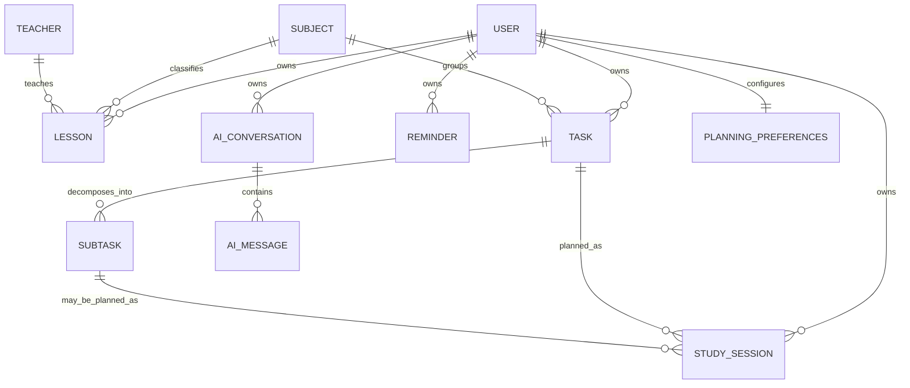

# Conceptual Domain Model

Status: Stage 01 conceptual model  
Important: this document defines **domain concepts and ownership**, not the final MySQL schema. Table names, columns, foreign keys, indexes, enum storage, and Eloquent relationship details are intentionally deferred to Stage 02.

Only the default `User` model is currently implemented. References below to an earlier SQL/ER draft come from the supplied Stage 01 review; that source draft is not present in this repository and its details have not been independently verified. See [database review notes](database-review-notes.md).

## 1. Domain boundaries

### Identity & Profile

**User**  
Authenticated owner of private planning data.

**Planning Preferences**  
User-defined constraints such as study windows, maximum daily/weekly workload, preferred breaks, and timezone-related planning behavior. This may become one or several persistence structures in Stage 02.

### Academic Context

**Subject**  
Academic course/subject used to group lessons and tasks.

**Teacher**  
Teacher metadata attached to lessons when available.

**Education Institution**  
An intended supporting backend concept already listed in the repository instructions and described in the earlier draft review. Stage 02 must still decide its ownership, required attributes, and exact relationship to users, subjects, and teachers; those persistence details are not fixed here.

**Academic Period / Semester**  
A candidate concept useful for repeated schedule imports and separating schedules across semesters. The supplied review reports no explicit semester structure in the earlier draft. Decide persistence in Stage 02.

### Schedule

**Lesson**  
A scheduled academic class with a subject, start/end time, type, and optional teacher/room metadata.

**Lesson Replacement / Schedule Change**  
Represents cancellation, substitution, or replacement behavior without losing the history of the original lesson. Whether this is a separate entity or a relation/state on `Lesson` is a Stage 02 decision.

**Schedule Import Batch**  
A candidate process entity/value that represents one Excel import attempt, its source file, validation state, preview, and commit result. Useful if import history/audit is retained.

### Tasks

**Task / Assignment**  
A user-owned academic work item with a title, optional subject, deadline, priority, estimated effort, and completion lifecycle.

**Subtask**  
A smaller ordered step belonging to exactly one task. It may have its own estimate and deadline.

### Planning

**Study Session**  
A concrete reserved time block allocated to a task or subtask.

**Free Time Slot**  
A calculated value object, not necessarily persisted. It is produced by subtracting blocking events and constraints from the user's allowed study windows.

**Planning Result / Planning Run**  
A candidate transient or persisted result representing generated sessions, warnings, unscheduled work, and feasibility. Persist only if the product needs history/audit of plan generations.

**Planning Conflict**  
A calculated result describing an overlap, insufficient capacity, deadline violation, or user-constraint violation. Usually returned by Services rather than stored as a permanent entity.

### Reminders

**Reminder**  
A user-owned instruction to notify the user at a specific instant or relative to a task/session deadline.

**Reminder Delivery**  
Optional future concept if delivery attempts, retries, channels, and delivery status need auditability. It is not required for the first persistence design unless notification delivery is implemented deeply.

### Progress & Reporting

**Progress Metrics**  
Mostly derived read data: counts, completion percentage, planned vs actual workload, late completion, subject workload.

**Progress Report**  
A generated view/document for a selected period. It does not need to be a persistent domain entity unless report history or generated files must be retained.

### AI Agent

**AI Conversation**  
User-owned conversational context.

**AI Message**  
A message within a conversation, including user/assistant role and optional structured tool metadata.

**Agent Tool Call**  
Conceptually an orchestration action. It may live inside message metadata initially; a separate audit entity is only justified if tool-level auditing becomes a requirement.

## 2. Conceptual relationships

This diagram is conceptual. It intentionally does not choose polymorphic foreign keys, nullable columns, pivot tables, or concrete cardinality for every optional concept.

The task and subtask links to study sessions represent possible planning targets, not a requirement for every session to reference both. Optional subject/teacher associations and default planning preferences must not be inferred as mandatory physical relationships from the diagram.

## 3. Aggregate / consistency boundaries

These are reasoning boundaries, not mandatory Laravel class structures.

### User-owned planning data

Every private resource belongs to exactly one authenticated user, directly or through a parent. Cross-user references are invalid.

### Task aggregate

A task owns its subtasks. Operations that reorder subtasks or calculate task progress should preserve task-level consistency.

### Plan/session consistency

Creating or rescheduling several study sessions for one planning action should be atomic when partial persistence would create an invalid plan.

### Schedule import consistency

A preview has no effect on the active schedule. Commit of an accepted import should use a transaction or another mechanism that prevents a half-imported schedule.

## 4. Value concepts

The following concepts should be represented explicitly in code when their behavior becomes non-trivial, but not necessarily as database tables:

- time interval;
- date range;
- estimated duration in minutes;
- priority;
- task status;
- lesson status/type;
- study-session status;
- planning constraint set;
- free slot;
- planning warning/conflict;
- progress percentage.

Prefer simple PHP enums/value objects only when they make rules safer or clearer. Do not create value-object classes for every scalar field.

## 5. State semantics to preserve

### Task

The requirements distinguish planned/open work, completed work, and unfinished work. The exact persisted status vocabulary must be normalized in Stage 02.

Important semantic rule: **overdue is primarily derivable from deadline + completion state + current time and should not automatically require a separate persisted status**.

### Study Session

A session needs to distinguish at least future/planned, completed, missed, and rescheduled/cancelled behavior. Exact enum values are Stage 02 work.

### Lesson

A lesson needs to distinguish active schedule entries from cancelled/replaced entries. Replacements must not cause both original and replacement to block the same time unintentionally.

## 6. Derived data

Avoid persisting data that can be deterministically recalculated unless there is a performance/audit reason.

Derived examples:

- free slots;
- overdue flag;
- task progress percentage;
- daily/weekly planned workload;
- subject workload totals;
- feasibility warnings;
- most statistics and report aggregates.

If later performance testing proves repeated calculation too expensive, introduce caching/materialized summaries deliberately.

## 7. Open questions for Stage 02

1. Is `Subject` strictly user-owned, institution-owned, or shared reference data?
2. Is `Teacher` user-specific or institution-wide?
3. What role and ownership should `EducationInstitution` have in the MVP schema, given that it is an intended backend responsibility but is only lightly specified by the user stories?
4. Should an explicit `AcademicPeriod/Semester` be persisted?
5. How should a `StudySession` reference either a task or a subtask without invalid multiple foreign keys?
6. How should reminders target tasks/sessions/subtasks: Laravel polymorphic relation, explicit nullable FKs, or another model?
7. Should schedule replacement be self-reference on lessons or a separate change entity?
8. Which status and priority values become PHP enums?
9. Which soft deletes are required and what should deletion mean for historical reports?
10. Which data should be hard-deleted versus retained for progress history?

These questions should be answered before migrations are written.
